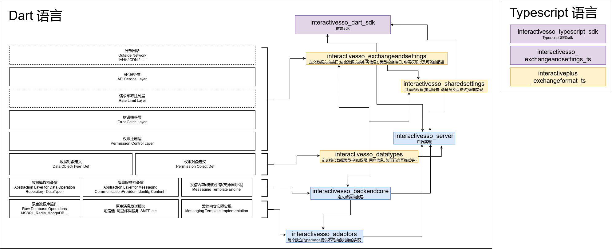

# 系统设计与架构

## 系统定位

系统交互图定义了InteractiveSSO的作用与其他潜在系统与用户的交互形式. SSO系统的存在是为了统一用户与其他形随意动旗下所有APP与微服务的交互行为, 为数据统计, 工单维护, 用户体验提供有力支撑.

## 系统架构

## 系统API结构及共识

### 全局API
1. 创建验证码API

### 前端API

#### 用户相关API

1. 用户注册API
   1. 允许用户使用邮箱 / 手机号注册账号
   2. 需要配套邮箱/手机验证API
2. 用户登录API
   1. 允许用户使用邮箱 / 手机号登录并由服务器分配Token, 同时返回用户基本信息
3. 验证Token API
   1. 允许前端验证用户API, 并返回用户基本信息
4. 用户查看设置和权限API
   1. 允许用户查看自己的设置与权限
   2. 允许用户修改自己的设置
5. 用户删除API

#### 用户授权API

1. 列出,查看,并管理已授权APP
   1. 列出/搜索已授权APP及链接到所属面具详细信息
   2. 获取授权记录详细信息
   3. 修改 / 取消授权
2. 列出,查看,并管理APP面具
   1. 列出/搜索 用户/APP下的所有面具
   2. 获取面具详细信息
   3. 修改 / 删除面具
3. 授权第三方APP API
   1. 授权第三方APP获得Authcode / APPToken

#### 第三方APP管理API

1. 列出, 查看, 并管理有管理权限 APP
   1. 列出/搜索有管理权限的APP
   2. 获取APP详细信息
   3. 修改/删除APP
   4. 修改管理列表
2. 创建新APP
   1. 返回新APP详细信息
3. 删除APP
   1. 必须拥有"拥有者"权限

### 第三方APP API

#### 第三方APP运营API
1. 使用Authcode交换获得access_token API
2. 使用refresh_token刷新access_token
3. 获取access_token相关信息
4. 验证access_token及权限
5. 列出/管理活跃的授权记录
   1. 列出/搜索授权记录
   2. 修改授权记录相关权限
   3. 删除授权
6. 推送消息API
7. 验证验证码API

### 官方APP 额外API
> 注: 官方APP拥有特殊权限
1. 验证所有APP密钥(client_id, client_secret)
2. 查看用户名下APP列表(不包含API详细信息)API
   1. OAuth授权时需要列出

### 管理员API
1. 列出/管理所有用户API
   1. 列出/搜索所有用户
   2. 修改用户
   3. 删除用户
2. 列出/管理所有用户组
   1. 列出/搜索所有用户组
   2. 修改用户组
   3. 删除用户组(需指定迁移目标用户组)
3. 列出/管理所有APP
   1. 列出/搜索所有APP
   2. 修改APP
   3. 删除APP
4. 列出/管理所有APP组
   1. 列出/搜索所有APP组
   2. 修改APP
   3. 删除APP
5. 列出/管理所有授权记录
   1. 列出/搜索所有授权记录
   2. 修改授权记录
   3. 删除授权记录
6. 列出/管理日志记录
   1. 列出/搜索日志记录
   2. 修改日志
   3. 删除单条日志
   4. 清空日志(+搜索条件)